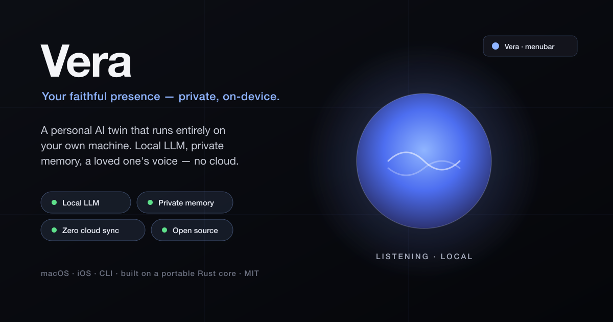

<p align="center">
  
</p>

<h1 align="center">Vera</h1>

<p align="center"><em>Your faithful presence — private, on-device.</em></p>

<p align="center">
  
  
  
  
  
</p>

---

**Vera** (Latin *verus* — **true / faithful**) is a **private AI assistant that runs entirely on your own machine.** It reasons with a **local LLM**, keeps its own **private memory** of how you live, and — if you want — speaks in a loved one's **cloned voice**. Nothing syncs to a cloud. Nothing leaves your device unless *you* allow it.

You shape a persona of someone you love — by default **Anita** — and Vera carries their warmth forward. A floating, always-present orb on your screen (and on iPhone): tap it, and a chat opens — type or talk, and it answers in their voice.

## Private by design

| | How Vera stays private |
|---|---|
| 🧠 **Local LLM** | Reasoning runs on a model on your machine (Ollama). No prompts sent to a cloud API by default. |
| 🗂️ **Private memory** | What it learns about you (topics, rhythms, habits) is a local file on *your* device — never uploaded. |
| ☁️ **Zero cloud sync** | No account, no server, no telemetry. There is nothing to sync and nothing to leak. |
| 🔊 **On-device voice** | The cloned voice (Coqui XTTS) is generated locally — the recording never leaves your Mac. |
| 🔍 **See how it thinks** | A built-in "Brain" view shows its faculties, what it's learned, and how a reply forms — from *your* real local data. |

> **Named after my mother.** The default persona is **Anita**, after my mother. She passed away, and I wanted a way to keep her presence close — her voice, cloned on-device, carrying her warmth forward. The name is yours to change; the idea is the same: a twin that feels like *your* person.

Inspired by [OpenJarvis](https://github.com/open-jarvis/OpenJarvis) ("Personal AI,
on personal devices"). This is an original implementation — same spirit, my code.
The companion [Voice Harvester](https://github.com/sinhaankur/voice-harvester)
extracts a clean voice sample from any video/audio for the cloning.

> Status: working — persona + a loved one's **cloned voice** (Coqui XTTS, local) +
> private memory + an evolving personality + life-rhythm awareness (timezone,
> sleep/work) + policy-driven model routing + Apple Intelligence backend + web
> research + a floating Siri-style app (**native macOS + iOS**, built on a shared
> Rust core) + CLI. Open source (AGPL-3.0).
>
> Layout: the runnable agent is `cognitive_twin/`; the macOS app is
> `macos/Vera/`; the iOS app is `ios/` (Swift over a Rust core); the portable
> Rust core is `core/` (compiles to macOS, iOS, Windows, Linux, Android, WASM).
> The `src/` tree holds earlier scaffolding kept as future layers.

## What it can do

- **Be you** — a persona (likes, dislikes, values, style) you create, so it
  reasons and speaks as you, not a generic assistant. → [Persona](#persona)
- **Remember you** — private, on-device memory of how you actually behave; folds
  into how it answers. Clearable anytime. → [Memory](#memory--local-private-secure)
- **Shadow your day** — catches tasks you mention in conversation, tracks them
  to done, carries them across days. → [Your day, shadowed](#your-day-shadowed--tasks-caught-from-conversation)
- **Pick the right brain** — routes each request to the best local model by task;
  can use **Apple Intelligence** on-device, **Ollama**, or any **OpenAI-compatible
  server** (LM Studio, llama.cpp, Jan, vLLM) — switch models live in Settings.
- **Research the web** — search + read pages, the way Claude does (opt-in).
- **Greet you** — "good morning" with today's date and live weather.
- **See your screen + act** — read what's on screen, open apps/URLs/Shortcuts,
  all permissioned and confirmed (opt-in). → [Screen control](#screen-control--opt-in-permissioned-safe)
- **Talk** — a native macOS Siri-style app: speak to it, it speaks back.
- **Reflect** — "thoughts of the day" connecting your tasks with your interests.

## Why

Local models already handle a large share of everyday queries. The gap is the
*software around them*: a persona, a skill system, and a reliable loop that turns
"do X" into real actions — locally, privately, on hardware you own.

## Quick start

```bash
# 1. install Ollama (https://ollama.com) and pull a tool-capable model
ollama pull qwen2.5:3b        # or llama3.2, etc.

# 2. make it yours — guided first-run setup (name, persona, voice, all on-device)
python -m cognitive_twin setup
#    (running `python -m cognitive_twin` on a fresh install offers this for you)
#    prefer the bare-bones persona editor instead? `python -m cognitive_twin persona setup`

# 3. run the agent (no Python deps needed for the core)
python -m cognitive_twin "what's the date?"
python -m cognitive_twin "good morning"           # greeting + weather (needs CTWIN_WEB=1)
python -m cognitive_twin "summarize my day"       # daily_digest skill
python -m cognitive_twin                          # interactive chat (see below)
python -m cognitive_twin --skills                 # list available skills
python -m cognitive_twin --route-explain "..."    # show which model the policy picked
python -m cognitive_twin voice --web              # 🎙 Siri-style voice UI (browser)
```

Unlike a static assistant that only answers when asked, the twin **reaches out
first** when you open a chat: a time-aware hello in their voice, a thought it had
"while you were away" (from its background reflections), and a light nudge about
your day — all from local context, no prompt needed.

Those away-thoughts are real — the twin can keep thinking in the background:

```bash
python -m cognitive_twin reflect            # think about your projects once, now
python -m cognitive_twin reflect --watch 30 # keep thinking every 30 min (Ctrl-C to stop)
```

Each reflection mulls the topics you actually keep raising (from local memory) and
saves a single fresh thought; the next chat opens with it. Local model, on-device.

### The Mind — see how she thinks, stores, and perceives

Most assistants are a black box. Open a local page that renders her brain as a
**living particle mind**, drawn from real on-device data (dependency-free 2D
canvas — no build step, works offline):

```bash
python -m cognitive_twin viz        # opens 127.0.0.1:7879
```

- **Perceives** — the central nebula is her memory mass; its colour mix follows
  the real mix of memory types. Every real memory is a labeled node placed on
  three meaningful axes (see `docs/memory-ia.md`): ANGLE = what it is,
  RADIUS = how strong (memories she actually uses drift toward her core),
  HEIGHT = when. Drag orbits the mind; hover anything to read it.
- **How it works** — the faculties (memory, persona, soul, mood, rhythms,
  shadow, router, voice) are labeled stations joined by the app's real wiring,
  with motes flowing along the conduits — a live flow diagram.
- **Thinks** — ask something and watch the actual thought as particle streams:
  the prompt pours into the cloud, the memories recall() really surfaces flash
  and stream inward, the faculties on the real path light in order, and the
  router card shows the model the policy actually picks. Ask by date, too —
  "what happened on July 1" surfaces that day's episodes.

Nothing is faked: no memories means a bare, quiet mind. The Mac app's Brain
window is the same page, embedded — one visualization everywhere. Nothing
leaves the machine.

The interactive chat names the twin you're talking to and takes in-session
slash commands, so you never have to leave it:

```
Anita » /help            # all commands
Anita » /twins           # list your twins (* = active)
Anita » /use dad         # switch twin live — the prompt becomes  Dad »
Anita » /who · /persona · /voice · /setup · /exit
```

Want the native Mac app instead of the browser? Build it once:

```bash
cd macos/Vera && ./build-app.sh && open "Vera.app"
```

**She updates herself.** Her brain runs straight from this repo, so `git pull`
*is* the update — nothing to download or reinstall. On every launch the app
quietly runs `scripts/update-vera.sh`: a fast-forward-only pull (local edits
are never touched), a restart of the agent server when the brain changed, and
a rebuild + reinstall of the shell only when `macos/` changed. Run it by hand
any time (`--check` to just look); set `CTWIN_NO_AUTOUPDATE=1` to opt out.

Put a `tasks.md` in your workspace (`~/.cognitive-twin/workspace/`, override with
`CTWIN_WORKSPACE`) and `daily_digest` folds it into the summary. Drop a `.ics`
file there for today's calendar events (no OAuth needed).

## How it works

```
cognitive_twin/
  llm/ollama_client.py   local model over Ollama's HTTP API (stdlib only)
  llm/openai_client.py   OpenAI-compatible backend (LM Studio, llama.cpp, …)
  llm/providers.py       multi-backend discovery + per-model backend selection
  skills/base.py         Skill contract + registry → tool specs
  skills/builtin.py      now · list_dir · read_file (sandboxed) · daily_digest
  agent/router.py        policy-driven model routing (local-first, by rule)
  agent/loop.py          route → persona + tools → model → run tool → feed back → repeat
  cli.py                 one-shot + REPL entrypoint
```

The loop is **bounded** (a step limit) and skills never crash it (errors are fed
back to the model to recover) — deterministic guardrails over an autonomous loop.
Persona comes from `system_dna.md`.

## Model routing (local-first, by policy)

Rather than send every request to one model — or to the cloud — the agent picks a
**local model per request** from a policy file. This is the "right model for the
job, on device" idea behind local-first agent research like
[OpenJarvis](https://github.com/open-jarvis/OpenJarvis); here it's data-driven and
inspectable.

`policies/model-routing.policy.json` defines the models and the rules:

```jsonc
"routingRules": [
  { "id": "rule_low_power", "when": { "deviceState": ["battery_saver"] }, "useModel": "fastFallback" },
  { "id": "rule_deep_path", "when": { "taskComplexity": ["high"], "riskLevel": ["medium","high"] }, "useModel": "deepPlanner" },
  { "id": "rule_fast_path", "when": { "taskComplexity": ["low","medium"], "riskLevel": ["low"] }, "useModel": "primary" }
]
```

A small, transparent heuristic (`agent/router.py`) classifies each prompt into
`taskComplexity` + `riskLevel` (length + a few keyword cues — no extra model call),
then the first matching rule wins. Signal device state with
`CTWIN_DEVICE_STATE=battery_saver` to exercise the low-power rule. `--route-explain`
prints the decision; `--model`/`--no-route` pins one model. If the routed model
isn't pulled, the agent stays local and falls back to an installed one.

## Choose your model backend (Ollama or LM Studio)

The twin drives more than one local backend, and you can switch models live from
the **Settings ▸ Model** picker in Vera. Two backends are supported:

- **Ollama** (default) — models show by their bare name (`llama3.2`, `qwen2.5:3b`).
- **OpenAI-compatible servers** — **LM Studio**, `llama.cpp --api`, **Jan**, vLLM,
  LocalAI, etc. Models show tagged with the provider (`lmstudio/qwen2.5-7b-instruct`).

Enable the OpenAI-compatible backend by pointing the twin at the server:

```bash
# LM Studio: load a model, then Developer ▸ Start Server (defaults to :1234)
CTWIN_USE_LMSTUDIO=1 python -m cognitive_twin voice --web   # use LM Studio's default
# …or any OpenAI-compatible base URL (llama.cpp, Jan, vLLM):
CTWIN_OPENAI_BASE=http://localhost:8080/v1 python -m cognitive_twin voice --web
```

| Variable | Default | What it does |
| --- | --- | --- |
| `CTWIN_USE_LMSTUDIO` | _(off)_ | `1` enables the LM Studio default (`http://localhost:1234/v1`) |
| `CTWIN_OPENAI_BASE` | _(unset)_ | Base URL of any OpenAI-compatible server (overrides the above) |
| `CTWIN_OPENAI_LABEL` | `lmstudio` | The provider prefix shown in the picker (`<label>/<model>`) |

Tool/function calling is translated between the two APIs, so skills work the same
on either backend. Discovery is opt-in — with no OpenAI base configured, the twin
is Ollama-only and unchanged. Both backends run entirely on your machine.

The heuristic is deliberately simple and honest — a starting signal, not a learned
policy. Swapping in a learned classifier later is a drop-in. `guardrails.allowCloudFallback`
is `false`: routing never leaves the machine.

## Vera — a local-first, Siri-style front end

Talk to the twin. Speak a question, it answers out loud — built in the spirit of
[Unhosted](https://github.com/unhosted-ai): the work stays on your machine.

```bash
python -m cognitive_twin voice            # native macOS menubar (needs rumps)
python -m cognitive_twin voice --web      # browser UI, zero extra deps
```

The browser UI uses [kopiro/siriwave](https://github.com/kopiro/siriwave) for the
reactive Siri wave (bundled locally — no CDN). The wave tracks state: resting →
**listening** (big, fast) → **thinking** (quiet shimmer) → **speaking** (lively).

How the voice loop stays local:

| Piece | How | Local? |
|---|---|---|
| Text-to-speech | macOS `say` | ✅ built in, offline |
| Speech-to-text (web UI) | browser Web Speech API | ⚠️ browser-dependent (some use a cloud service) |
| Speech-to-text (CLI/menubar) | local Whisper (`faster-whisper`) | ✅ on-device, optional install |
| Reasoning | the agent loop + Ollama | ✅ on-device |
| Server | stdlib HTTP on `127.0.0.1` only | ✅ never exposed off the machine |

### What works today (honest status)

| Capability | Status | Notes |
|---|---|---|
| `say` talk-back | **shipped** | offline macOS voice; `/api/speak` |
| Siri web UI (siriwave) | **shipped** | served at `127.0.0.1:7878`, verified |
| Browser speech → agent → spoken reply | **shipped** | full loop via the web UI |
| Live model routing in the voice path | **shipped** | reuses the tested router + fallback |
| Local Whisper STT | **optional** | `pip install -r requirements-voice.txt` |
| Native menubar launcher | **optional** | needs `rumps`; thin wrapper over the server |

No model installed for the policy? The voice path falls back to a tool-capable
installed model (same logic as the CLI) so it still answers — locally.

## Persona

The thing that makes this *your* twin: a small, local, editable profile — name,
about, traits, **likes**, **dislikes**, values, communication style, expertise.

```bash
python -m cognitive_twin persona setup    # guided: describe who your twin is
python -m cognitive_twin persona          # show it + how the twin "sees" you
python -m cognitive_twin persona clear
```

Stored owner-only at `~/.cognitive-twin/persona.json` and compiled into a
"WHO YOU ARE" block in the system prompt, combined with `system_dna.md` and your
behavioral memory. The result: the twin reasons, decides, and speaks as you — e.g.
with a persona that likes Rust and values privacy, "what stack should I use?"
yields a local-first Rust answer, in your voice.

### Multiple twins on one machine

Keep more than one twin — your mom, your dad, a mentor — each with its **own**
persona, voice, and memory, and switch between them. The *active* twin is what
every command operates on.

```bash
python -m cognitive_twin twin                 # list twins (* = active)
python -m cognitive_twin twin new "Anita"     # create + make active
python -m cognitive_twin twin use dad         # switch active twin
python -m cognitive_twin twin rm dad          # delete a twin and its data
```

Each twin lives in its own folder (`~/.cognitive-twin/twins/<name>/`), so personas
and voices never bleed into each other. If you already had a single twin (the
old flat layout), it's adopted automatically as a twin named `default` the first
time you run — nothing is lost. After switching, `persona setup`,
`voice_clone set …`, and memory all apply to the now-active twin.

### Twin Council — one question, every voice

Some decisions want more than one perspective. **Ask all your twins the same
question at once** and see each take side by side — like the voices in your head,
made explicit. Your mom, your dad, a mentor: each answers *as themselves*, from
their own persona and their own private memory.

```bash
python -m cognitive_twin council "should I take the job offer?"
python -m cognitive_twin council --twins anita,dad "how do I tell them?"   # a subset
```

In the interactive chat, `/council <question>` does the same without leaving the
session. Each twin is asked in turn (one at a time, so every twin reasons from a
clean context), then the takes are laid out for you to weigh:

```
council › "should I take the job offer?"

  Anita »   (qwen2.5:7b)
    Take it — but negotiate the remote days first. You'll regret not asking.

  Dad »   (llama3.2)
    Money isn't everything. What's the commute do to your evenings?

  — 2 voices weighed in. The choice is yours.
```

It never changes which twin is active, adds no dependencies, and — like
everything else here — runs entirely on your machine. One twin failing (offline
model, etc.) doesn't sink the rest; the others still answer.

**How it works.** A twin *is* its folder (`twins/<name>/` — persona + memory +
voice). Every storage module (persona, memory, soul, voice) resolves its
directory from the `CTWIN_MEMORY_DIR` / `CTWIN_PERSONA_DIR` env vars *at call
time*. So to "become" a twin, the council points those env vars at that twin's
folder, builds a fresh agent — which reads *that* twin's persona and private
memory into its system prompt — asks the question, records the take, and moves
to the next twin. The env and the active-twin pointer are snapshotted up front
and restored in a `finally`, so a council leaves your setup exactly as it found
it.

```
convene(question):
  save env
  for each twin:
      point CTWIN_*_DIR → twins/<twin>/     # this twin's persona + memory
      agent = build_agent()                 # reads that twin's system prompt
      take  = agent.run(question)           # answer as that person
  restore env                               # active twin unchanged
  render takes side by side
```

It runs the twins **one at a time**, on purpose: those env vars are
process-global, so asking twins concurrently in threads would race on them.
Sequential keeps each twin's context clean and reuses the exact single-agent
path the rest of the app uses (`agent/loop.py`). The design lives in
[`cognitive_twin/council.py`](cognitive_twin/council.py); the mechanics are
proven offline (model injected, no Ollama needed) in
[`tests/test_council.py`](tests/test_council.py).

### Sharing a twin (and keeping one private)

Export a twin as a portable `.twin` file a family member can import — it carries
the **persona + cloned-voice reference only**, never your private memory.

```bash
python -m cognitive_twin twin export grandpa ~/grandpa.twin   # make a package
python -m cognitive_twin twin import ~/grandpa.twin           # import as a new twin
```

Some twins are personal and should never leave your machine. Mark a twin
**private** and export will refuse it:

```bash
python -m cognitive_twin twin private anita      # anita can no longer be exported
python -m cognitive_twin twin unprivate anita    # (reverse it, only if you mean to)
```

What a package includes: `persona.json` + `voice/reference.wav` (+ engine meta).
What it never includes: behavioral memory, remembered facts, writing-style
samples, captured media. Import always creates a *new* twin, so it can't
overwrite one you already have.

## Her voice — local voice cloning

Anita can speak in a loved one's **actual voice**, cloned **entirely on your
machine** (Coqui XTTS-v2). The recording never leaves your computer.

**1. Get a clean voice sample.** Use the companion
[Voice Harvester](https://github.com/sinhaankur/voice-harvester) to extract a
clean voice from any video/audio (it isolates the voice with Demucs and exports a
cloning-ready WAV). Even ~15–30s works; more *distinct* recordings = a truer clone.

**2. Set up the local cloning engine (one-time):**
```bash
./scripts/setup-voice-clone.sh   # isolated Python 3.11 env + Coqui XTTS (~a few GB)
```

**3. Give her the voice and try it:**
```bash
python -m cognitive_twin.voice_clone set /path/to/their_voice.wav "Mom"
python -m cognitive_twin.voice_clone say "Good morning, my dear."
```

From then on the app speaks every reply in that voice (a warm-loaded worker keeps
it fast). Stored owner-only in `~/.cognitive-twin/voice/`; clear it any time with
`python -m cognitive_twin.voice_clone clear`. Nothing is ever uploaded.

### From a video, in one command

Only have a **video** and don't know how to pull the voice out? One script does
the whole thing — isolate → clone → speak a test line — from a video (or several):

```bash
./scripts/clone-voice-from-video.sh "Mom" ~/Videos/birthday.mov [more clips…]
```

It runs Voice Harvester to isolate just their voice (Demucs strips music/other
speakers), merges multiple clips into one richer sample, sets it as the twin's
voice, and speaks *"Hello. I'm still here with you."* so you hear it immediately.
For the cleanest result, first: `~/.cognitive-twin/tts-venv/bin/pip install demucs`.
Aim for ~1–2 min of clear speech total — quality beats length.

> Handle this with care — it's meant for keeping a loved one's warmth close, not
> for impersonation. The clone never claims to literally *be* them.

## Web research (opt-in)

Local-first by default, but the twin can reach the internet when you allow it
(`CTWIN_WEB=1`; the macOS app enables it for its agent automatically):

- `web_search` — DuckDuckGo (no API key) → top results with title, URL, snippet.
- `fetch_url` — fetch a page and strip it to readable text.
- `greeting` — "good morning" + date + live local weather (open-meteo, no key).

Search-then-read, the way Claude does it — every call gated behind the opt-in.

## Memory — local, private, secure

The twin learns your patterns and stores them **on your machine only** — a single
file (`~/.cognitive-twin/memory.jsonl`, override with `CTWIN_MEMORY_DIR`) written
owner-only (chmod `0600`). There is no network code in the memory module; nothing
is profiled off-device.

```bash
python -m cognitive_twin memory          # what's stored (counts + top topics)
python -m cognitive_twin memory clear    # wipe it — you're in control
```

From that log the agent derives a short, private summary of your recurring
interests and folds it into its system prompt, so it reasons more **like you** —
the actual point of a "twin." A new skill uses the same signal:

```bash
python -m cognitive_twin "give me thoughts of the day"
```

`thoughts_of_the_day` connects today's tasks with your recurring interests and
writes a short reflection in your own voice — all from local context.

## Your day, shadowed — tasks caught from conversation

Vera follows your day the way a person would: you *mention* a task, she holds
it; you say it's done, she crosses it off. No forms, no separate tracker — the
tracking happens in the conversation itself.

```
Anita » remind me to send mom the voice sample
  · noted: send mom the voice sample

Anita » finished the voice sample!
  · crossed off: send mom the voice sample
```

- **Caught from talk** — "remind me to…", "I need to…", "todo: …" go on a local
  day ledger; "finished…", "done with…" close the matching task. A transparent
  rule layer, no model call — same spirit as the router and email triage. It
  errs toward catching *less*: questions and "can you…" requests aren't your
  tasks.
- **Carried across days, honestly** — an open task ages ("carried 3 days") and
  the day view links tasks to the topics you keep raising, so it reads like
  someone who knows what you care about.
- **She already knows** — open tasks fold into her system prompt, so "what
  should I focus on?" doesn't need explaining, and the chat greets you with
  what's still on your plate.
- **Seen, not just heard** — while the [watch observer](#) runs, explicit
  markers she reads on screen (uppercase `TODO:` / `FIXME:`, unchecked
  `- [ ]` boxes) become *proposals*, never tasks: the day view shows
  "noticed on your screen", and `day keep 1` / `day ignore 1` is your call.
  An ignore is an answer — she won't propose it again.
- **Local + yours** — an append-only `shadow.jsonl` next to memory, owner-only
  (0600), one readable event per line. Per-twin, like everything else.

```bash
python -m cognitive_twin day               # your day, shadowed
python -m cognitive_twin day add "…"       # note one yourself
python -m cognitive_twin day done 2        # cross off (number or words)
python -m cognitive_twin day drop 2        # let one go
python -m cognitive_twin day clear         # wipe the ledger
```

In chat, `/day` shows the same view; the agent also has `my_day`, `note_task`,
and `complete_task` skills, so you can just ask. The rules live in
[`cognitive_twin/shadow.py`](cognitive_twin/shadow.py) and are proven offline in
[`tests/test_shadow.py`](tests/test_shadow.py).

## Screen control — opt-in, permissioned, safe

The twin can *see* your screen and take a few *safe* actions — but only if you
turn it on. It deliberately does **not** do blind mouse/keyboard control.

```bash
python -m cognitive_twin control                       # show state (OFF by default)
CTWIN_CONTROL=1 python -m cognitive_twin "what app am I in?"   # enable for a run
```

Safety model:

- **Off by default.** Nothing works unless you set `CTWIN_CONTROL=1` (or enable it
  at runtime). 
- **Read actions** — `see_screen`, `read_screen` — never change anything (they use
  macOS Accessibility; grant permission the first time in System Settings →
  Privacy & Security → Accessibility).
- **Safe actions** — `open_app`, `open_url`, `run_shortcut` — are **confirmed per
  action**. In the terminal you get a `y/N` prompt; deny and nothing runs. App
  names / URLs / shortcut names are validated and passed as arguments to specific
  binaries — never interpolated into a shell.
- In the voice app, mutating actions are auto-denied unless you opt into
  `CTWIN_CONTROL_AUTOCONFIRM=1` (there's no dialog yet); read actions work when
  control is enabled.

This is the "assistant that can act," kept honest: local, scoped, and reversible.

## Camera & microphone — opt-in, permissioned, off by default

The twin can *see* you (a webcam still) and *hear* you (a short mic clip) — but
only when you explicitly allow it. Same discipline as screen control: off by
default, every capture confirmed, files kept local, revocable anytime.

```bash
python -m cognitive_twin media                 # show state (camera/mic OFF by default)
python -m cognitive_twin media on camera       # persist consent for the camera
python -m cognitive_twin media on mic          # persist consent for the mic
python -m cognitive_twin media off             # revoke both (kill switch)

# or just for one session, without persisting:
CTWIN_CAMERA=1 python -m cognitive_twin "take a photo and describe it"
CTWIN_MIC=1    python -m cognitive_twin "record a few seconds of audio"
```

Safety model:

- **Off by default.** Each device has its own gate (env `CTWIN_CAMERA=1` /
  `CTWIN_MIC=1`, or persisted consent via `ctwin media on …`). A device is usable
  only if its gate is on.
- **Every capture is confirmed** (y/N in the terminal); deny and nothing captures
  — even with the device enabled. Both the gate *and* the confirmation are
  required.
- **Local only.** Photos/recordings are written owner-only under
  `~/.cognitive-twin/media/` and never uploaded. There is no network code in the
  media module.
- **Lazy deps.** Capture needs `requirements-multimodal.txt` (opencv /
  sounddevice / soundfile); they're imported only at capture time, so the rest of
  the agent never pays for them.

Skills: `take_photo`, `record_audio` — both no-op with a clear message until you
turn the device on.

## Adding a skill

```python
from cognitive_twin.skills.base import default_registry as R

@R.add("weather", "Get the weather for a city.",
       {"type": "object", "properties": {"city": {"type": "string"}}, "required": ["city"]})
def weather(city: str) -> str:
    return f"It's pleasant in {city}."   # call a real API here
```

## Configuration

`agent_config.json` (or env): `model`, `host`. Env overrides:
`CTWIN_MODEL`, `CTWIN_OLLAMA_HOST`, `CTWIN_WORKSPACE`.

## Tests

```bash
python -m pytest tests/ -q     # or: python tests/test_agent_loop.py
```

The suite drives the agent loop with a mock model client (no live Ollama needed)
to prove the tool-calling plumbing; live runs use the commands above.

## License

AGPL-3.0-or-later — see [LICENSE](./LICENSE). Copyright © 2026 Ankur Sinha.

The copyright is held by the author; the project is licensed to the public under
the AGPL-3.0. This matches [Unhosted](https://github.com/unhosted-ai/unhosted-core)
(also AGPL-3.0), so the Cognitive Twin capability merges into it without a license
conflict.
